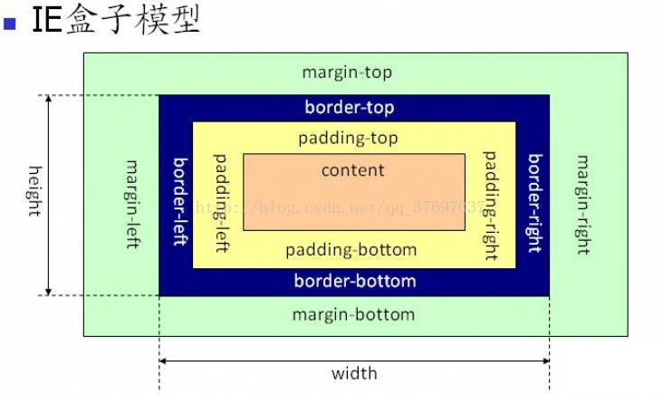
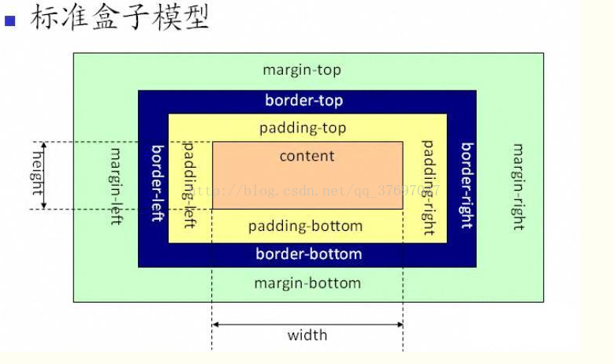

# HTML

## 浏览器标准模式和怪异模式
浏览器本身分为两种模式，一种是标准模式，一种是怪异模式，浏览器通过 **doctype** 来区分这两种模式。
### 怪异模式
::: tip 提示
盒模型为IE盒模型：height = border + padding + content
:::


### 标准模式
::: tip 提示
W3C标准盒模型： height = content
:::


## Label标签
### 作用
label 标签来定义表单控制间的关系，当用户选择该标签时，浏览器会自动将焦点转到和标签相关的表单控件上。

### 用法
<font color=#3eaf7c>**id绑定**</font>   
``` html
<form>
  <label for="name">name:</label>
  <input type="input" name="uname" id="name" />
</form>
```
<font color=#3eaf7c>**嵌套**</font>   
``` html
<form>
  <label><input type="input" name="uname" id="name" /></label>
</form>
```

## src 与 href 的区别
- src 用于引用资源，替换当前元素，用在 img，script，iframe 上，src 是页面内容不可缺少的一部分。
- href 用于在当前文档和引用资源之间确立联系，用在 link 和 a 等元素上。

## 前端页面的三层结构
1. 结构层：由 HTML 或 XHTML 之类的标记语言负责创建，对网页内容的语义含义做出了描述。
2. 表示层：由 CSS 负责创建， CSS 对“如何显示有关内容”的问题做出了回答。
3. 行为层：Javascript 语言和 DOM 主宰的领域，负责回答“内容应该如何对事件做出反应”这一问题。