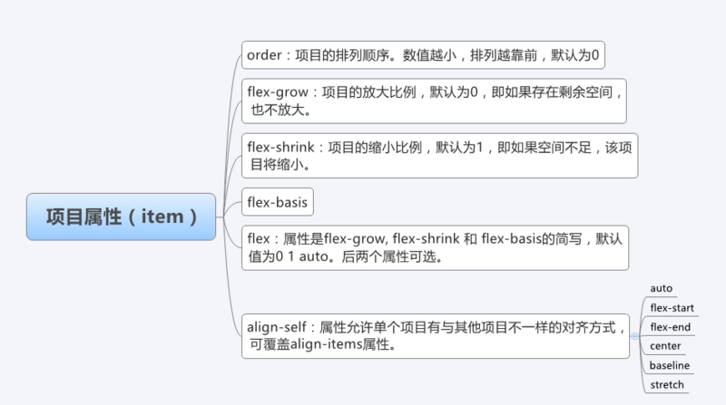

# CSS

## position 几个属性的作用
> **position 的常见四个属性值： relative，absolute，fixed，static。一般都要配合"left"、"top"、"right"
以及 "bottom" 属性使用。**

::: warning Position
static: 默认值，它始终会处于页面流给予的位置（static 元素会忽略任何 top、bottom、left 或 right 声明）。一般不常用。  

relative: **可将其移至相对于其正常位置的地方**，意思就是如果设置了 relative 值，那么，它偏移的 top，right，bottom，left 的值都以它原来的位置为基准偏移，而不管其他元素会怎么样。<font color=#c7254e>注意 relative 移动后的元素在原来的位置仍占据空间。</font>

absolute: 可定位于相对于包含它的元素的指定坐标。意思就是如果它的父容器设置了 position 属性，并且 position 的属性值为 absolute 或者 relative，那么就会依据父容器进行偏移。如果其父容器没有设置 position 属性，那么偏移是以 body 为依据。<font color=#c7254e>注意设置 absolute 属性的元素在标准流中不占位置。</font>  

fixed: 位置被设置为 fixed 的元素，**可定位于相对于浏览器窗口的指定坐标。不论窗口滚动与否，元素都会留在那个位置。它始终是以 body 为依据的。** <font color=#c7254e>注意设置 fixed 属性的元素在标准流中不占位置。</font>  

sticky: sticky 是 css 定位新增属性；可以说是 static（没有定位） 和 固定定位 fixed 的结合；它主要用在对 scroll 事件的监听上；简单来说，在滑动过程中，某个元素距离其父元素的距离达到 sticky 粘性定位的要求时(比如top：100px)；position:sticky 这时的效果相当于 fixed 定位，固定到适当位置。
:::

## px，em，rem 的区别
+ 像素 px 是相对于显示器屏幕分辨率而言的，是一个虚拟长度单位。
+ em 是相对长度单位，相对于当前对象内文本的字体尺寸。它会继承父级元素的字体大小，因此并不是一个固定的值。
+ rem 是 CSS3 新增的一个相对单位，使用 rem 为元素设定字体大小时，仍然是相对大小，但相对的只是 HTML 根元素。


## 怎么让一个不定宽高的 DIV，垂直水平居中
+ 父盒子：display：table-cell； text-align：center；vertical-align：middle；  
  子盒子：display：inline-block；vertical-align：middle；
+ 父盒子：display：relative；
  子盒子：transform： translate(-50%，-50%)；position： absolute；top： 50%；left：50%；

## CSS实现居中  
+ ### 文字居中
  - 水平方向居中：text-align:center;
  - 单行文本垂直方向居中：line-height: 元素的高度;
  - 父元素高度不固定时：使用padding样式解决（即使上下padding相等）
  - 父元素高度固定时：  
    ``` css
      父元素{  
        display: table;  
      }   
      子元素{  
        display: table-cell;  
        vertical-align: middle;  
      }  
    ```
+ ### 图片居中
  - 水平居中：父元素的css中加入：text-align:center;
  - 垂直居中：
    ``` css
      父元素 {
        position: relative;
      }
      子元素 {
        position: absolute;
        top: 50%;
        margin-top: -50%;
      }
    ```
+ ### 元素居中
  - 块级元素的水平居中（注：只能块级）：{margin:0 auto;} 要设置元素的宽否则块级默认宽度100%，则水平居中无效。
  - 内联元素
    * 水平居中：text-align:center;
    * 垂直居中：vertical-align:middle;
  - 其他
    ``` css
      父元素 {
        position: relative;
      }
      子元素 {
        position: absolute;
        top: 50%;
        margin-top: -50%;
      }
    ```
    ``` css
      /*弹性布局*/
      父元素 {
        display: flex;
        justify-content: center; 
        align-items: center;
      }
    ```
     ``` css
      /*适合在子元素不确定宽高和数量时使用*/
      父元素 {
       display: table-cell;
       vertical-align: middle;
       text-align: center;
      }
      子元素 {
        display: inline-block;
      }
    ```
    
## Flex布局
::: tip 基本概念
采用 Flex 布局的元素，称为 Flex 容器（flex container），简称"容器"。它的所有子元素自动成为容器成员，称为 Flex 项目（flex item），简称"项目"。

在 Flexbox 模型中，有三个核心概念：
+ flex 容器，其包含 flex 项
+ flex 项（注：也称 flex 子元素），需要布局的元素
+ 排列方向（direction），这决定了 flex 项的布局方向  


:::


[参考](https://www.cnblogs.com/hellocd/p/10443237.html)


## BFC(Block formatting context)
> **BFC(Block formatting context)直译为"块级格式化上下文"。它是一个独立的渲染区域，只有Block-level box 参与，它规定了内部的 Block-level Box 如何布局，并且与这个区域外部毫不相干。**
### BFC的布局规则
+ 内部的 Box 会在垂直方向，一个接一个地放置
+ Box 垂直方向的距离由 margin 决定。属于**同一个BFC**的两个相邻 Box 的 margin 会发生**重叠**。
+ 每个盒子（块盒与行盒）的 margin box 的左边，与包含块 border box 的左边相接触，即使存在浮动也是如此。
+ BFC 的区域不会与float box重叠。
+ BFC 就是页面上的一个隔离的独立容器，容器里面的子元素不会影响到外面的元，反之也如此。
+ 计算 BFC 的高度时，浮动元素也参与计算。

### 如何创建BFC
+ float 的值不为 none。
+ position 的值不为 static 或者 relative 。
+ display 的值是 inline-block、table-cell、flex、table-caption 或者 inline-flex 。
+ overflow 的值不为 visible。

### BFC的作用
1. 利用 BFC 避免 margin 重叠。
2. 自适应两栏布局。
3. 清除浮动。

[参考](https://blog.csdn.net/sinat_36422236/article/details/88763187)

## CSS 权重
CSS 权重优先级顺序：!important > 行内样式 > ID > 类、伪类、属性 > 标签名 > 继承 > 通配符
|选择器|权重|
|-----|----|
|!important|1/0（无穷大）|
|行内样式|1000|
|ID|100|
|类、伪类、属性|10|
|标签|1|
|通配符|0|

## 清除浮动的方式
1. 父级 div 定义 height
  + 父级 div 手动定义 height，就解决了父级 div 无法自动获取到高度的问题。 简单、代码少、容易掌握 ，但只适合高度固定的布局。
2. 结尾处加空 div 标签 clear：both
  + 在浮动元素的后面添加一个空 div 兄弟元素，利用 css 提高的 clear：both 清除浮动，让父级 div 能自动获取到高度 ，如果页面浮动布局多，就要增加很多空 div，让人感觉很不好 。
3. 父级 div 定义 伪类：after 和 zoom
  + ``` css
      /*清除浮动代码*/
      .clearfix：after{
       content：""；
       display：block；
       visibility：hidden；
       height：0；
       line-height：0；
       clear：both；
       }
       /*触发hasLayout 给IE6清除浮动*/
      .clearfix{zoom：1}  
     ```
4. 父级 div 定义 overflow：hidden
  + 超出盒子部分会被隐藏，不推荐使用。
5. 双伪元素法
  + ``` css
      .clearfix：before，.clearfix：after {
       content： ""；
       display： block；
       clear： both；
       }
       .clearfix {
       zoom： 1；
       }
     ```

## 渐进增强和优雅降级 
+ 渐进增强：针对低版本浏览器进行构建页面，保证最基本的功能，然后再针对高级浏览器进行效果、交互等改进和追加功能达到更好的用户体验。
``` css
/ *那如果我们的产品要求我们要重低版本的浏览器兼容开始*/
 a{
/*优先考虑低版本的*/
 -webkit-transition：all 1s ease 0s；
 -moz-transition：all 1s ease 0s；
 -o-transition： all 1s ease 0s；
 /*高版本的就肯定是渐进渐强*/
 transition： all 1s ease 0s；
}
```
+ 优雅降级：一开始就构建完整的功能，然后再针对低版本浏览器进行兼容。
``` css
a{
 display： block；
 width： 200px；
 height： 100px；
 background：aquamarine；
 /*我就是要用这个新 css 属性*/
 transition： all 1s ease 0s；
 /*可是发现了一些低版本浏览器不支持怎么吧*/
 /*往下兼容*/
 -webkit-transition：all 1s ease 0s；
 -moz-transition：all 1s ease 0s；
 -o-transition： all 1s ease 0s；
 /*那么通常这样考虑的和这样的侧重点出发的 css 就是优雅降级*/
}
```

## 为什么利用多个域名来存储网站资源会更有效
1. CDN 缓存更方便。
2. 突破浏览器并发限制，浏览器一次能发送的http请求是有限的。
3. 节约cookie带宽。
4. 减少主域名的连接数，优化页面响应速度。
5. 防止不必要的安全问题。

## 网页的重绘与重排以及重构
+ **重绘** 是一个元素外观的改变所触发的浏览器行为，例如改变 visibility、outline、背景色等属性。浏览器会根据元素的新属性重新绘制，使元素呈现新的外观。重绘不会带来重新布局，并不一定
伴随重排。
+ **重排** 是更明显的一种改变，可以理解为渲染树需要重新计算。下面是常见的触发重排的操作：
  1. DOM 元素的几何属性变化 。
  2. DOM 树的结构变化 。
  3. 获取某些属性 。
  4. 此外，改变元素的一些样式，调整浏览器窗口大小等等也都将触发重排。  
**（重排对性能有很大的影响）**
+ **页面重构** 编写 CSS、让页面结构更合理化，提升用户体验，实现良好的页面效果和提升性能。
+ **网站重构** 在不改变外部行为的前提下，简化结构、添加可读性，而在网站前端保持一致的行为。也就是说是在不改变 UI 的情况下，对网站进行优化，在扩展的同时保持一致的 UI。
::: tip 例子
对于传统的网站来说重构通常是：  
表格(table)布局改为 DIV+CSS  
使网站前端兼容于现代浏览器(针对于不合规范的 CSS、如对 IE6 有效的)  
对于移动平台的优化   

针对于 SEO 进行优化  
深层次的网站重构应该考虑的方面：  
减少代码间的耦合  
让代码保持弹性  
严格按规范编写代码  
设计可扩展的 API  
代替旧有的框架、语言(如 VB)  
增强用户体验  
优化响应速度    

速度的优化重构：  
压缩 JS、CSS、image 等前端资源(通常是由服务器来解决)  
程序的性能优化(如数据读写)  
采用 CDN 来加速资源加载  
对于 JS DOM 的优化  
HTTP 服务器的文件缓存  
:::

## CSS3 新特性
1. 颜色：新增 RGBA，HSLA 模式
2. 文字阴影（text-shadow）
3. 边框： 圆角（border-radius）边框阴影： box-shadow
4. 盒子模型：box-sizing
5. 背景：background-size 设置背景图片的尺寸 background-origin 设置背景图片的原点background-clip 设置背景图片的裁切区域，以”，”分隔可以设置多背景，用于自适应布局
6. 渐变：linear-gradient、radial-gradient
7. 过渡：transition，可实现动画
8. 自定义动画 animate @keyfrom
9. 在 CSS3 中唯一引入的伪元素是 ：：selection
10. 媒体查询，多栏布局 @media screen and (width:800px){ … }
11. border-image
12. 2D 转换：transform：translate(x，y) rotate(x，y) skew(x，y) scale(x，y)
13. 3D 转换
14. 字体图标 font-face
15. 弹性布局 flex
### CSS3 box-sizing
  + box-sizing: content-box; 表示标准的盒子模型
    - 标准的盒子模型的宽度 = content+padding+border
  + box-sizing: border-box; 表示的是 IE 盒子模型（width = content + padding + border）
    - IE 盒子模型的宽度 = width
  + box-sizing: padding-box; 这个属性值的宽度包含了左右 padding + width

### [CSS Grid 网格布局教程](https://www.ruanyifeng.com/blog/2019/03/grid-layout-tutorial.html)

## 伪类与伪元素
**伪类的操作对象是文档树中已有的元素，而伪元素则创建了一个文档数外的元素。**  
**因此，伪类与伪元素的区别在于：有没有创建一个文档树之外的元素。**  
**伪类和选择器之间用一个冒号隔开，伪元素则是两个冒号隔。**


## transition（过渡） transform（变换） animation（动画）
+ transform：描述了元素的静态样式，本身不会呈现动画效果，可以对元素进行 旋转rotate、扭曲skew、缩放scale和移动translate以及矩阵变形matrix。
  
  [参考](https://developer.mozilla.org/zh-CN/docs/Web/CSS/transform)
+ transition样式过渡，从一种效果逐渐改变为另一种效果
  - **transition: transition-property transition-duration transition-timing-function transition-delay**  
    * transition-property: 过渡属性(默认值为all)
    * transition-duration: 过渡持续时间(默认值为0s)
    * transiton-timing-function: 过渡函数(默认值为ease函数)
    * transition-delay: 过渡延迟时间(默认值为0s) 

**<font color="red">transition 通常和 hover 等事件配合使用，需要由事件来触发过渡</font>**
  ``` css
  div{
      width：100px;
      height:100px;
      transition:transform 2s;
  }
  div：hover{
      transform:rotate(180deg);
  }
  ```
+ animation动画 由@keyframes来描述每一帧的样式
  ``` css
  div{
     animation:myAnimation 5s infinite
  }
  @keyframes myAnimation{
      0% {left:0; transform:rotate(0);}
      100% {left:200px; transform:rotate(180deg);}　　  
  }
  ```
::: danger 区别
（1）transform 仅描述元素的静态样式，常常配合 transition 和 animation 使用

（2）transition 通常和 hover 等事件配合使用，animation 是自发的，立即播放

（3）animation 可设置循环次数

（4）animation 可设置每一帧的样式和时间，transition 只能设置头尾
:::

## CSS 小细节
### CSS 引入的方式
内联 内嵌 外链 导入

### 块元素和行元素
+ 块元素：独占一行，并且有自动填满父元素，可以设置 margin 和 pading 以及高度和宽度
+ 行元素：不会独占一行，width 和 height 会失效，并且在垂直方向的 padding 和 margin 会失效。

### 文本省略号
#### 单行元素的文本省略号
``` css
  overflow: hidden;  
  text-overflow: ellipsis;  
  white-space: nowrap;  
```
#### 多行元素的文本省略号
``` css
  /*使文字数量不同在相同的地方显示，给盒子加固定高度 */

  overflow: hidden;
  /*将盒子转换为弹性盒子*/
  display: -webkit-box; 
  /*设置显示多少行*/
  -webkit-line-clamp: 2; 
  /*文本以省略号显示*/   
  text-overflow: ellipsis; 
```

### link 和 @import 的区别
+ @import 是 CSS 提供的语法规则，只有导入样式表的作用；  
  link 是 HTML 提供的标签，不仅可以加载 CSS 文件，还可以定义 RSS、rel 连接属性等。  
+ 加载页面时，link 标签引入的 CSS 被同时加载；@import引入的 CSS 将在页面加载完毕后被加载。
+ link 引入的样式权重大于 @import 引入的样式。

### CSS Reset
HTML标签在浏览器中都有默认的样式，不同的浏览器的默认样式之间存在差别。  
CSS Reset 就是将浏览器的默认样式全部覆盖掉，重置浏览器的 CSS 默认属性。
::: warning CSS 样式初始化的目的
考虑到浏览器的兼容问题，其实不同浏览器对有些标签的默认值是不同的，如果没对 CSS初始化往往会出现浏览器之间的页面差异。
:::

### Web 语义化
+ 使用语义恰当的标签。
+ 使页面有良好的结构，页面元素有含义。
+ 能够让人和搜索引擎都容易理解。

### inline ， block， inline-blockd的区别
+ inline
  - 使元素变成行内元素，拥有行内元素的特性，即可以与其他行内元素共享一行，不会独占一行
  - **不能更改元素的height，width的值，大小由内容撑开**
  - 可以使用padding，margin的left和right产生边距效果，**但是top和bottom就不行**
+ block
  - 使元素变成块级元素，独占一行，在不设置自己的宽度的情况下，**块级元素会默认填满父级元素的宽度**
  - 能够改变元素的height，width的值
  - 可以设置padding，margin的各个属性值，top，left，bottom，right都能够产生边距效果
+ inline-block
 - 使元素变成**行内块元素**，**既有行内元素的（一行可有多个）特性，又有块元素的（可设宽高）特性**
 - 能够改变元素的height，width的值
 - 可以设置padding，margin的各个属性值，top，left，bottom，right都能够产生边距效果

### display： none；与 visibility： hidden 的区别
+ display：none； 使用该属性后，HTML 元素（对象）的宽度、高度等各种属性值都将“丢失”。
+ visibility：hidden； 使用该属性后，HTML 元素（对象）仅仅是在视觉上看不见（完全透明），**而它所占据的空间位置仍然存在**，也即是说它仍具有高度、宽度等属性值。

### CSS Hack
针对不同的浏览器写不同的 CSS code 的过程，就是 CSS hack。
::: tip ie6,7,8 的 hack

:::

### overflow 属性值
+ Visible：默认值。内容不会被修剪，会呈现在元素框之外。
+ Hidden：内容会被修剪，并且其余内容是不可见的。
+ Scroll：内容会被修剪，但是浏览器会显示滚动条以便查看其余的内容。
+ Auto：如果内容被修剪，则浏览器会显示滚动条以便查看其余的内容。
+ Inherit：规定应该从父元素继承 overflow 属性的值

### console 常用的方法
+ console.log() 向 Web 控制台输出一条消息。
+ console.error() 向 Web 控制台输出一条错误消息。
+ console.clear() 清空控制台。  
[参考](https://developer.mozilla.org/zh-CN/docs/Web/API/Console)

### rgba() 和 opacity 的区别
> **rgba()和 opacity 都能实现透明效果**
+ opacity 作用于元素，以及元素内的所有内容的透明度
+ rgba() 只作用于元素的颜色或其背景色。（设置 rgba 透明的元素的子元素不会继承透明效果）

### Sass、LESS
Sass、LESS是 CSS 预处理器,是一种特殊的语法/语言编译成 CSS。
::: tip 例如
Less 是一种动态样式语言. 将 CSS 赋予了动态语言的特性，如变量，继承，运算,函数。  
结构清晰，便于扩展，可以轻松实现多重继承，完全兼容 CSS 代码，可以方便地应用到老项目中。
:::

### 行内元素、块级元素、空(void)元素、样式之间的转换
+ CSS 规范规定，每个元素都有 display 属性，确定该元素的类型，每个元素都有默认的 display值，比如 div 默认 display 属性值为“block”，成为“块级”元素；span 默认 display 属性值为“inline”，是“行内”元素。 
+ 行内元素有：`<a> <b> <span>  <input> <select> <strong>（强调的语气）`
+ 块级元素有：`<div> <ul> <ol> <li> <dl> <dt> <dd> <h1> <h2> … <p>` 
+ 空(void)元素：`<br> <hr>  <input> <link> <meta>`
+ 样式转换：
  - display：block 行内元素转换为块级元素
  - display：inline 块级元素转换为行内元素
  - display：inline-block 转为内联元素

### visibility=hidden, opacity=0，display:none
+ visibility = hidden
  - 该元素隐藏起来了，但不会改变页面布局。
  - 元素上绑定的事件无法触发。
+ opacity = 0
  - 元素隐藏起来了，但不会改变页面布局。
  - 元素上面绑定的事件(click)是**可以触发的。**
+ display: none
  - 元素隐藏起来，**并且会改变页面布局。**
  - 元素上绑定的事件无法触发。

### 隐藏页面中某个元素的几种方法
``` css
display:none; 
visibility:hidden; 
opacity: 0; 
position 移到外部;
z-index 涂层遮盖等等
```

### 外边距折叠
::: tip
多个相邻（兄弟或者父子关系）普通流的 **块元素 垂直方向** marigin 会重叠  
折叠的结果为：  
两个相邻的外边距都是正数时，折叠结果是它们两者之间较大的值。  
两个相邻的外边距都是负数时，折叠结果是两者绝对值的较大值。  
两个外边距一正一负时，折叠结果是两者的相加的和。  
:::

### float 的元素，display 是什么
**display 为 block** 

### calc 属性
**calc 用户动态计算长度值，任何长度值都可以使用 calc()函数计算，*需要注意的是，运算符前后都需要保留一个空格*，例如：width: calc(100% - 10px)；**

### display：table 和 `<table>`
::: warning 区别
display：table 的 css 声明能够让一个html 元素和它的子节点像 table 元素一样，使用基于表格的 css 布局，是我们能够轻松定义一个单元格的边界，背景等样式，而不会产生因为使用了 table 那样的制表标签导致的语义化问题。

之所以现在逐渐淘汰了 table 系表格元素，是因为用 div+css 编写出来的文件比用 table边写出来的文件小，而且 table 必须在页面完全加载后才显示，div 则是逐行显示，table的嵌套性太多，没有 div 简洁。
:::

### line-height 和 height 的区别
+ line-height 一般是指布局里面一段文字上下行之间的高度，是针对字体来设置的。
+ height 一般是指容器的整体高度。

### 如何不在本身上进行操作，改变一个 DOM 元素的字体颜色
更改父元素的 color

### 设置一个元素的背景颜色，背景颜色会填充哪些区域
**background-color 设置的背景颜色会填充元素的 content、padding、border 区域。**
