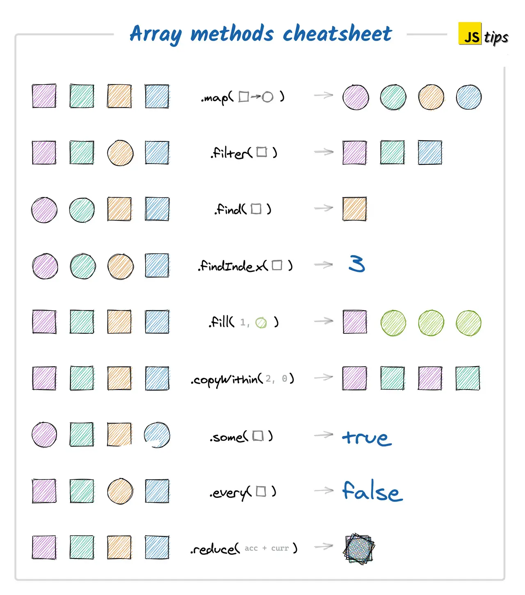
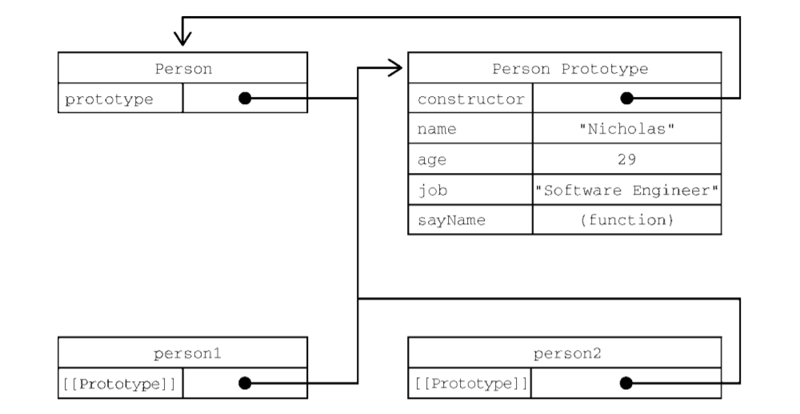
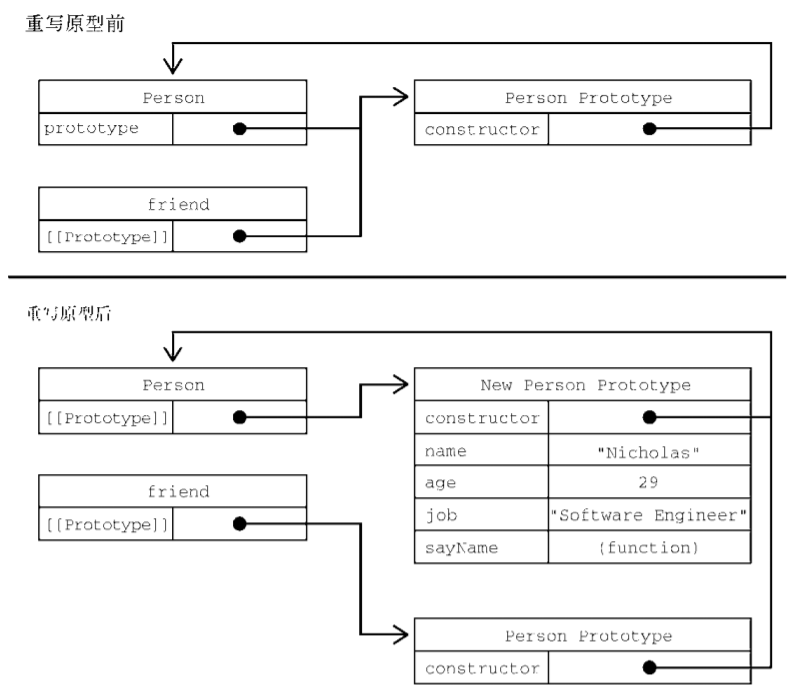
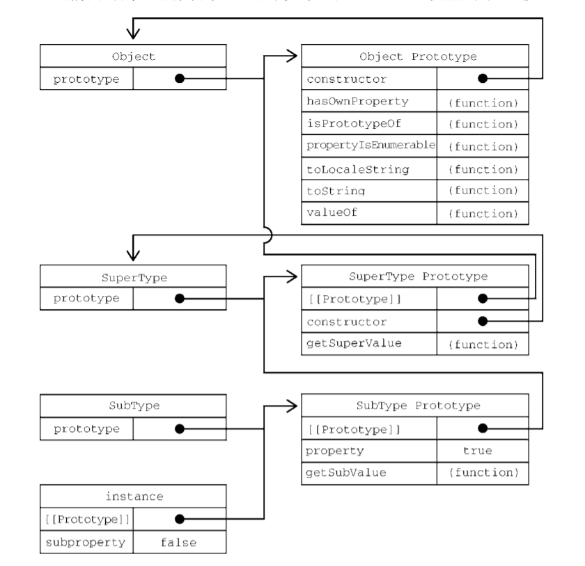

# JS

## `<script>`
### 推迟执行脚本
为`<script>`元素定义了一个叫 **defer** 的属性，脚本会被延迟到整个页面都解析完毕后再运行。因此，在`<script>`元素上
**设置 defer 属性，**相当于告诉浏览器**立即下载，但延迟执行。**

### 异步执行脚本
`<script>`元素定义了 async 属性。从改变脚本处理方式上看，**async 属性与 defer 类似。**当然，它们两者也都只适用于外部脚本，都会告诉浏览器立即开始下载。不过，与 defer 不同的
是，标记为 **async** 的脚本并**不保证能按照它们出现的次序执行**，比如：
``` html
  <head>
   <title>Example HTML Page</title>
   <script async src="example1.js"></script>
   <script async src="example2.js"></script>
  </head> 
```

### 动态加载脚本
JavaScript 可以使用 DOM API，所以通过向 DOM 中动态添加 script 元素同样可以加载指定的脚本。
``` js
  let script = document.createElement('script');
  script.src = 'gibberish.js';
  document.head.appendChild(script); 
```

##  var 声明提升、let 关键字、const 关键字
``` js
  使用 var 时，下面的代码不会报错。这是因为使用这个关键字声明的变量会自动提升到函数作用域
顶部：
function foo() {
 console.log(age);
 var age = 26;
}
foo(); // undefined
之所以不会报错，是因为 ECMAScript 运行时把它看成等价于如下代码：
function foo() {
 var age;
 console.log(age);
 age = 26;
}
foo(); // undefined
这就是所谓的“提升”（hoist），也就是把所有变量声明都拉到函数作用域的顶部。
```

::: tip let
let 声明的范围是块作用域，而 var 声明的范围是函数作用域。    
var **可以重复**声明同一个变量 例如：var age = 16;  var age = 26;   
let **不可以重复**声明同一个变量 例如：let age = 16;  let age = 26; //  SyntaxError；标识符 age 已经声明过了
:::

::: warning const
const 声明变量时必须同时初始化变量，且尝试修改 const 声明的变量会导致运行时错误。  
const 声明的限制只适用于它指向的变量的引用。  
换句话说，如果 const 变量引用的是一个对象，那么修改这个对象内部的属性并不违反 const 的限制。
:::

## 数据类型
+ 6 种简单数据类型（**基本数据类型**）
  - Undefined、Null、Boolean、Number、String 和 Symboll（符号）是 ECMAScript 6 新增的。
+ 1 种复杂数据类型（**引用数据类型**）
  - Object（对象）是一种无序名值对的集合。

+ Undefined 类型
  - 当使用 var 或 let 声明了变量但没有初始化时，就相当于给变量赋予了 undefined 值。
+ Null 类型
  - Null 类型同样只有一个值，即特殊值 null。逻辑上讲，null 值表示一个空对象指针，这也是给 typeof 传一个 null 会返回 "object" 的原因。
+ String 类型
  - ECMAScript 中的字符串是不可变的（immutable），意思是一旦创建，它们的值就不能变了。要修改某个变量中的字符串值，必须先销毁原始的字符串，然后将包含新值的另一个字符串保存到该变量。
  - toString()方法：可作用于于 数值、布尔值、对象和字符串值（除 null 和 undefined 没有 toString() 方法）
  - toString()可以接收一个底数参数
  ``` js
  let num = 10;
  console.log(num.toString()); // "10"
  console.log(num.toString(2)); // "1010"
  console.log(num.toString(8)); // "12"
  console.log(num.toString(10)); // "10"
  console.log(num.toString(16)); // "a" 
  ```
  - **模板字面量**  
    ECMAScript 6 新增了使用模板字面量定义字符串的能力。与使用单引号或双引号不同，模板字面量保留换行字符，可以跨行定义字符串。

## typeof 与 instanceof 区别
+ typeof 返回值为：string、boolean、number、function、object、undefined
  - typeof 对于 Array, Null 等特殊对象使用 typeof 一律返回 object， 这正是 typeof 的局限性。
+ instanceof 返回值为布尔值
  - instanceof 用于判断一个变量是否属于某个对象的实例。  
    `var a = new Array();  
     alert(a instanceof Array); // true`

## for in、for of
for...in 循环主要是为了遍历对象而生，不适用于遍历数组。  
for...of 循环可以用来遍历数组、**类数组对象**，字符串、Set、Map 以及 Generator 对象。  
[参考](https://www.cnblogs.com/rogerwu/p/10738776.html)

## 函数传递参数
  ECMAScript 中所有函数的参数都是**按值传递**的。这意味着函数外的值会被复制到函数内部的参数中，就像从一个变量复制到另一个变量一样。如果是原始值，那么就跟原始值变量的复制一样，如果是引用值，那么就跟引用值变量的复制一样。

## 执行上下文
  每个函数调用都有自己的上下文。当代码执行流进入函数时，函数的上下文被推到一个上下文栈上。在函数执行完之后，上下文栈会弹出该函数上下文，将控制权返还给之前的执行上下文。ECMAScript 程序的执行流就是通过这个上下文栈进行控制的。   
  上下文中的代码在执行的时候，会创建变量对象的一个作用域链（scope chain）。这个作用域链决定了各级上下文中的代码在访问变量和函数时的顺序。

## 标识符查找
  搜索开始于作用域链前端，以给定的名称搜索对应的标识符。如果在局部上下文中找到该标识符，则搜索停止，变量确定；  
  如果没有找到变量名，则继续沿作用域链搜索。（注意，作用域链中的对象也有一个原型链，因此搜索可能涉及每个对象的原型链。）这个过程一直持续到搜索至全局上下文的变量对象。

## 原始值包装类型
  ECMAScript 提供了 3 种特殊的引用类型：Boolean、Number 和 String。  
  每当用到某个原始值的方法或属性时，后台都会创建一个相应原始包装类型的对象，从而暴露出操作原始值的各种方法。  
  在以读模式访问字符串值的任何时候，后台都会执行以下 3 步：  
  (1) 创建一个 String 类型的实例；  
  (2) 调用实例上的特定方法；  
  (3) 销毁实例。
  ``` js
  let s1 = "some text";
  let s2 = s1.substring(2); 
  ```
  ``` js
  let s1 = new String("some text");
  let s2 = s1.substring(2);
  s1 = null; 
  ```
  引用类型与原始值包装类型的主要区别在于对象的生命周期。在通过 new 实例化引用类型后，得到的实例会在离开作用域时被销毁，而自动创建的原始值包装对象则只存在于访问它的那行代码执行期间。
   
## string 常用方法
### slice()、substring()、substr()
``` js
  let stringValue = "hello world";
  console.log(stringValue.slice(3)); // "lo world"
  console.log(stringValue.substring(3)); // "lo world"
  console.log(stringValue.substr(3)); // "lo world"
  console.log(stringValue.slice(3, 7)); // "lo w"
  console.log(stringValue.substring(3,7)); // "lo w"
  console.log(stringValue.substr(3, 7)); // "lo worl" 第二个参数对它而言表示返回的字符数。
```
``` js
  let stringValue = "hello world";
  console.log(stringValue.slice(-3)); // "rld" （长度加上负参数）实际上调用的是 slice(8)
  console.log(stringValue.substring(-3)); // "hello world" 返回整个字符串，因为-3 会转换为 0
  console.log(stringValue.substr(-3)); // "rld" （长度加上负参数）
  console.log(stringValue.slice(3, -4)); // "lo w" 第二个参数转换为 7，实际上相当于调用 slice(3, 7)
  console.log(stringValue.substring(3, -4)); // "hel" 会将第二个参数转换为 0，相当于调用substring(3, 0) 等价于 substring(0, 3) 这个方法会将较小的参数作为起点，将较大的参数作为终点
  console.log(stringValue.substr(3, -4)); // "" (empty string) 第二个参数会被转换为 0，意味着返回的字符串包含零个字符，因而会返回一个空字符串。
```

### indexOf()、lastIndexOf()
两者的区别在于，indexOf()方法从**字符串开头**开始查找子字符串，而 lastIndexOf()方法从**字符串末尾**开始查找子字符串。
``` js
  let stringValue = "hello world";
  console.log(stringValue.indexOf("o")); // 4
  console.log(stringValue.lastIndexOf("o")); // 7 
```
这两个方法都可以接收可选的第二个参数，表示开始搜索的位置。
``` js
  let stringValue = "hello world";
  console.log(stringValue.indexOf("o", 6)); // 7
  console.log(stringValue.lastIndexOf("o", 6)); // 4  
```

### startsWith()、endsWith()、includes()
这些方法都会从字符串中搜索传入的字符串，并返回一个表示是否包含的布尔值。
``` js
  let message = "foobarbaz";
  console.log(message.startsWith("foo")); // true
  console.log(message.startsWith("bar")); // false
  console.log(message.endsWith("baz")); // true
  console.log(message.endsWith("bar")); // false
  console.log(message.includes("bar")); // true
  console.log(message.includes("qux")); // false 
```

### trim()
这个方法会创建字符串的一个副本，删除前、后所有空格符，再返回结果。
``` js
  let stringValue = " hello world ";
  let trimmedStringValue = stringValue.trim();
  console.log(stringValue); // " hello world "
  console.log(trimmedStringValue); // "hello world" 
```

### 字符串解构
``` js
  let message = "abcde";
  console.log([...message]); // ["a", "b", "c", "d", "e"]
```

### toLowerCase()、toUpperCase()
``` js
  let stringValue = "hello world"; 
  console.log(stringValue.toUpperCase()); // "HELLO WORLD"
  console.log(stringValue.toLowerCase()); // "hello world" 
```

### replace()
``` js
  let text = "cat, bat, sat, fat";
  let result = text.replace("at", "ond");
  console.log(result); // "cond, bat, sat, fat"
  result = text.replace(/at/g, "ond");
  console.log(result); // "cond, bond, sond, fond" 
```
``` js
  function htmlEscape(text) {
  /* (match, pos, originalText) 与整个模式匹配的字符串、匹配项在字符串中的开始位置，以及整个字符串。*/
   return text.replace(/[<>"&]/g, function(match, pos, originalText) {
   switch(match) {
   case "<":
   return "&lt;";
   case ">":
   return "&gt;";
   case "&":
   return "&amp;";
   case "\"":
   return "&quot;";
   }
   });
  }
  console.log(htmlEscape("<p class=\"greeting\">Hello world!</p>"));
  // "&lt;p class=&quot;greeting&quot;&gt;Hello world!</p>" 
```

### split()
``` js
  let colorText = "red,blue,green,yellow";
  let colors1 = colorText.split(","); // ["red", "blue", "green", "yellow"]
  let colors2 = colorText.split(",", 2); // ["red", "blue"]
  let colors3 = colorText.split(/[^,]+/); // ["", ",", ",", ",", ""] 
```

## Math
+ Math.floor()方法始终向下舍入为最接近的整数。  
+ Math.round()方法执行四舍五入。  
+ Math.fround()方法返回数值最接近的单精度（32 位）浮点值表示。  
+ Math.random()
  - 返回一个 0~1 范围内的随机数，其中包含 0 但不包含 1。
  - 基于公式使用 Math.random()从一组整数中随机选择一个数：  
    **`number = Math.floor(Math.random() * total_number_of_choices + first_possible_value) `**
    ``` js
      let num = Math.floor(Math.random() * 10 + 1); // 1~10 范围内随机选择一个数
      let num = Math.floor(Math.random() * 9 + 2);  // 2~9 范围内随机选择一个数
    ```

## Array 常用方法
+ 使用 Array 构造函数创建数组
``` js
  let colors = new Array();
  let colors = new Array(20);   
  let colors = new Array("red", "blue", "green");

  // 在使用 Array 构造函数时，也可以省略 new 操作符
  let colors = Array(3);  
  let names = Array("Greg"); 
```
+ 数组字面量（array literal）表示法  
`let colors = ["red", "blue", "green"];`

### valueOf()
返回数组本身
``` js
  let colors = ["red", "blue", "green"]; 
  alert(colors.valueOf()); // red,blue,green 
```

### join()
``` js
  let colors = ["red", "green", "blue"];
  alert(colors.join(",")); // red,green,blue
  alert(colors.join("||")); // red||green||blue 
```

### 栈方法 push()、pop()
``` js
  let colors = ["red", "blue"];
  colors.push("brown"); // 再添加一项
  colors[3] = "black"; // 添加一项
  alert(colors.length); // 4
  let item = colors.pop(); // 取得最后一项
  alert(item); // black 
```

### 队列方法 shift()、unshift()
``` js
  let colors = new Array(); // 创建一个数组
  let count = colors.push("red", "green"); // 推入两项
  alert(count); // 2
  count = colors.push("black"); // 再推入一项
  alert(count); // 3
  let item = colors.shift(); // 取得第一项
  alert(item); // red
  alert(colors.length); // 2 
  /*======================================================================*/
  let colors = new Array(); // 创建一个数组
  let count = colors.unshift("red", "green"); // 从数组开头推入两项
  alert(count); // 2
  count = colors.unshift("black"); // 再推入一项
  alert(count); // 3
  let item = colors.pop(); // 取得最后一项
  alert(item); // green
  alert(colors.length); // 2 
```

### 排序方法 reverse()、sort()
+ reverse()
``` js
  let values = [1, 2, 3, 4, 5];
  values.reverse();
  alert(values); // 5,4,3,2,1 
```
+ sort()
::: danger 注意
**默认情况下**，sort()会按照**升序**重新排列数组元素，即最小的值在前面，最大的值在后面。  
为此，sort()会在每一项上调用 **String()转型函数**，然后比较字符串来决定顺序。  
即使数组的元素都是数值，也会**先把数组转换为字符串**再比较、排序。  
``` js
/*错误！*/
let values = [0, 1, 5, 10, 15];
values.sort();
alert(values); // 0,1,10,15,5
```
**sort()方法可以接收一个比较函数**  
比较函数接收两个参数，如果第一个参数应该排在第二个参数前面，就返回负值；如果两个参数相等，就返回 0；如果第一个参数应该排在第二个参数后面，就返回正值。
``` js
function compare(value1, value2) {
 if (value1 < value2) {
  return -1;
 } else if (value1 > value2) {
  return 1;
 } else {
  return 0;
 }
} 

如果数组的元素是数值,这个比较函数还可以写得更简单
function compare(value1, value2){
 return value2 - value1;
} 
/*===========================================================*/
let values = [0, 1, 5, 10, 15];
values.sort(compare);
alert(values); // 0,1,5,10,15 

此外，这个比较函数还可简写为一个箭头函数：
let values = [0, 1, 5, 10, 15];
values.sort((a, b) => a < b ? 1 : a > b ? -1 : 0);
alert(values); // 15,10,5,1,0 
```
:::

### concat()
concat()首先会创建一个当前数组的副本，然后再把它的参数添加到副本末尾，最后返回这个新构建的数组。
``` js
let colors = ["red", "green", "blue"];
let colors2 = colors.concat("yellow", ["black", "brown"]);
console.log(colors); // ["red", "green","blue"]
console.log(colors2); // ["red", "green", "blue", "yellow", "black", "brown"]
```

### slice()
``` js
let colors = ["red", "green", "blue", "yellow", "purple"];
let colors2 = colors.slice(1);
let colors3 = colors.slice(1, 4);
alert(colors2); // green,blue,yellow,purple
alert(colors3); // green,blue,yellow 
```
如果 slice() 的参数有负值，那么就以数值长度加上这个负值的结果确定位置。  
如果结束位置小于开始位置，则返回空数组。

### splice()
+ 删除
  - 需要给 splice() 传 2 个参数：要删除的第一个元素的位置和要删除的元素数量。
+ 插入
  - 需要给 splice() 传 3 个参数：开始位置、0（要删除的元素数量）和要插入的元素，第三个参数之后还可以传第四个、第五个参数，乃至任意多个要插入的元素。
+ 替换
  - 需要给 splice() 传入 3 个参数：开始位置、要删除元素的数量和要插入的任意多个元素。
``` js
let colors = ["red", "green", "blue"];
let removed = colors.splice(0,1); // 删除第一项
alert(colors); // green,blue
alert(removed); // red，只有一个元素的数组
removed = colors.splice(1, 0, "yellow", "orange"); // 在位置 1 插入两个元素
alert(colors); // green,yellow,orange,blue
alert(removed); // 空数组
removed = colors.splice(1, 1, "red", "purple"); // 插入两个值，删除一个元素
alert(colors); // green,red,purple,orange,blue
alert(removed); // yellow，只有一个元素的数组
```

### indexOf()、lastIndexOf()和 includes()
``` js
let numbers = [1, 2, 3, 4, 5, 4, 3, 2, 1];

alert(numbers.indexOf(4)); // 3
alert(numbers.lastIndexOf(4)); // 5
alert(numbers.includes(4)); // true

alert(numbers.indexOf(4, 4)); // 5
alert(numbers.lastIndexOf(4, 4)); // 3
alert(numbers.includes(4, 7)); // false

let person = { name: "Nicholas" };
let people = [{ name: "Nicholas" }];
let morePeople = [person];

alert(people.indexOf(person)); // -1
alert(morePeople.indexOf(person)); // 0
alert(people.includes(person)); // false
alert(morePeople.includes(person)); // true 
```

### find()、findIndex()
``` js 
const people = [
 {
  name: "Matt",
  age: 27
 },
 {
  name: "Nicholas",
  age: 29
 }
];
alert(people.find((element, index, array) => element.age < 28));
// {name: "Matt", age: 27}
alert(people.findIndex((element, index, array) => element.age < 28));
// 0 
```
### 迭代方法 every()、filter()、forEach()、map() 和 some()
+ every()：对数组每一项都运行传入的函数，如果对每一项函数都返回 true，则这个方法返回 true。
+ filter()：对数组每一项都运行传入的函数，函数返回 true 的项会组成数组之后返回。
+ forEach()：对数组每一项都运行传入的函数，没有返回值。
+ map()：对数组每一项都运行传入的函数，返回由每次函数调用的结果构成的数组。
+ some()：对数组每一项都运行传入的函数，如果有一项函数返回 true，则这个方法返回 true。  
**<font color="red">这些方法都不改变调用它们的数组。</font>**

``` js
let numbers = [1, 2, 3, 4, 5, 4, 3, 2, 1];
let everyResult = numbers.every((item, index, array) => item > 2);
alert(everyResult); // false
let someResult = numbers.some((item, index, array) => item > 2);
alert(someResult); // true 
/*==================================================================*/
let numbers = [1, 2, 3, 4, 5, 4, 3, 2, 1];
let filterResult = numbers.filter((item, index, array) => item > 2);
alert(filterResult); // 3,4,5,4,3 
/*==================================================================*/
let numbers = [1, 2, 3, 4, 5, 4, 3, 2, 1];
let mapResult = numbers.map((item, index, array) => item * 2);
alert(mapResult); // 2,4,6,8,10,8,6,4,2
/*==================================================================*/
let numbers = [1, 2, 3, 4, 5, 4, 3, 2, 1];
numbers.forEach((item, index, array) => {
 // 执行某些操作
}); 
```
### 归并方法 reduce()、reduceRight()
+ reduce()方法从数组第一项开始遍历到最后一项。而 reduceRight()从最后一项开始遍历至第一项。
+ reduce()和 reduceRight()的函数接收 4 个参数：上一个归并值、当前项、当前项的索引和数组本身。这个函数返回的任何值都会作为下一次调用同一个函数的第一个参数。
``` js
let values = [1, 2, 3, 4, 5];
let sum = values.reduce((prev, cur, index, array) => prev + cur);
alert(sum); // 15
/*第一次执行归并函数时，prev 是 1，cur 是 2。  
第二次执行时，prev 是 3（1 + 2），cur 是 3（数组第三项）。  
如此递进，直到把所有项都遍历一次，最后返回归并结果。*/

let values = [1, 2, 3, 4, 5];
let sum = values.reduceRight(function(prev, cur, index, array){
 return prev + cur;
});
alert(sum); // 15 
/*在这里，第一次调用归并函数时 prev 是 5，而 cur 是 4。当然，最终结果相同，  
因为归并操作都是简单的加法。*/
```


## 函数
函数是ECMAScript中最有意思的部分之一，这主要是因为函数实际上是对象。  
因为函数是对象，所以函数名就是指向函数对象的指针，而且不一定与函数本身紧密绑定。
### 箭头函数
箭头函数语法简洁
``` js
let arrowSum = (a, b) => {
 return a + b;
}; 
console.log(arrowSum(5, 8)); // 13 
```
如果只有一个参数，可以不用括号。只有没有参数，或者多个参数的情况下，才需要使用括号：
``` js
// 以下两种写法都有效
let double = (x) => { return 2 * x; };
let triple = x => { return 3 * x; };

// 没有参数需要括号
let getRandom = () => { return Math.random(); };

// 多个参数需要括号
let sum = (a, b) => { return a + b; };

// 无效的写法：
let multiply = a, b => { return a * b; }; 
```
箭头函数也可以不用大括号，，那么箭头后面就只能有一行代码，比如一个赋值操作，或者一个表达式。
``` js 
// 以下两种写法都有效，而且返回相应的值
let double = (x) => { return 2 * x; };
let triple = (x) => 3 * x;

// 可以赋值
let value = {};
let setName = (x) => x.name = "Matt";
setName(value);
console.log(value.name); // "Matt"

// 无效的写法：
let multiply = (a, b) => return a * b; 
```
**<font color="red">箭头函数不能使用 arguments、super 和 new.target，也不能用作构造函数。此外，箭头函数也没有 prototype 属性。</font>**

### arguments 对象
arguments 是一个对应于传递给函数的参数的类数组对象。  
在使用 function 关键字定义（非箭头）函数时，可以在函数内部访问 arguments 对象，从中取得传进来的每个参数值。  
``` js
function func1(a, b, c) {
  console.log(arguments[0]);
  // expected output: 1
  console.log(arguments[1]);
  // expected output: 2
  console.log(arguments[2]);
  // expected output: 3
}

func1(1, 2, 3);
```
#### arguments 的 callee 属性
callee 属性是一个指向 arguments 对象所在函数的指针。
``` js
经典的阶乘函数：
function factorial(num) {
 if (num <= 1) {
 return 1;
 } else {
 return num * factorial(num - 1);
 }
} 
/*===============================================================================*/
使用 arguments.callee 就可以让函数逻辑与函数名解耦：
function factorial(num) {
 if (num <= 1) {
 return 1;
 } else {
 return num * arguments.callee(num - 1);
 }
} 
```

### this 对象
#### 标准函数中
this 引用的是把函数当成方法<font color="red">**调用**</font>的上下文对象，这时候通常称其为 this 值（在网页的全局上下文中调用函数时，this 指向 windows）。
``` js
window.color = 'red';
let o = {
 color: 'blue'
};
function sayColor() {
 console.log(this.color);
}
sayColor(); // 'red'
o.sayColor = sayColor;
o.sayColor(); // 'blue' 
```
#### 匿名函数
匿名函数的 this 一般都是指向 window

#### 箭头函数中
this 引用的是<font color="red">**定义**</font>箭头函数的上下文。
``` js
window.color = 'red';
let o = {
 color: 'blue'
};
let sayColor = () => console.log(this.color);
sayColor(); // 'red'
o.sayColor = sayColor;
o.sayColor(); // 'red' 
```
::: tip 例子
``` js
function King() {
 this.royaltyName = 'Henry';
 // this 引用 King 的实例
 setTimeout(() => console.log(this.royaltyName), 1000);
} 

function Queen() {
 this.royaltyName = 'Elizabeth';
 // this 引用 window 对象
 setTimeout(function() { console.log(this.royaltyName); }, 1000);
}

new King(); // Henry
new Queen(); // undefined 

```
:::

### caller
ECMAScript 5 给函数对象上添加一个属性：caller。  
这个属性引用的是调用当前函数的函数，或者如果是在全局作用域中调用的则为 null。
``` js
function outer() {
 inner();
}
function inner() {
 console.log(inner.caller);
}
outer();
以上代码会显示 outer()函数的源代码。这是因为 ourter()调用了 inner()，inner.caller
指向 outer()。如果要降低耦合度，则可以通过 arguments.callee.caller 来引用同样的值：
function outer() {
 inner();
}
function inner() {
 console.log(arguments.callee.caller);
}
outer();
```

### apply()、call()、bind()
+ apply()
  - apply()方法接收两个参数：函数内 this 的值和一个参数数组。第二个参数可以是 Array 的实例，但也可以是 arguments 对象。
``` js
function sum(num1, num2) {
 return num1 + num2;
}
function callSum1(num1, num2) {
   第二个参数可以是Array或arguments 
 return sum.apply(this, arguments); // 传入 arguments 对象
 return sum.apply(this, [num1, num2]); // 传入数组
} 
```

+ call()
  - 与 apply()的作用一样，只是传参的形式不同。  
    第一个参数跟 apply()一样，也是 this 值，而剩下的要传给被调用函数的参数则是逐个传递的。
``` js
function sum(num1, num2) {
 return num1 + num2;
}
function callSum(num1, num2) {
 return sum.call(this, num1, num2);
}
console.log(callSum(10, 10)); // 20 
```

+ bind()
  - bind的传参方式和call一样，只不过它的不同之处是，**apply和call方法**调用之后会**立即执行**，而**bind方法调用之后会返回一个新的函数，它并不会立即执行，需要我们手动执行。**
``` js
window.color = 'red';
var o = {
 color: 'blue'
};
function sayColor() {
 console.log(this.color);
}
// bind方法调用之后会返回一个新的函数
let objectSayColor = sayColor.bind(o);  
// 需要手动调用
objectSayColor(); // blue 
```
::: warning apply()和 call()真正强大的地方并不是给函数传参，而是控制函数调用上下文即函数体内 this 值的能力。
``` js
window.color = 'red';
let o = {
 color: 'blue'
};
function sayColor() {
 console.log(this.color);
}
sayColor(); // red
sayColor.call(this); // red
sayColor.call(window); // red
sayColor.call(o); // blue 

```
:::


## 闭包
::: danger 理解作用域链
每个执行上下文中都会有一个**包含其中变量的对象**。  
**全局上下文**中的叫**变量对象**，它会在代码执行期间始终存在。  
而**函数局部上下文**中的叫**活动对象**，只在函数执行期间存在。  
在**定义函数**时，会为它创建作用域链，预装载全局变量对象，并保存在内部的[[Scope]]中。  
在**调用这个函数**时，会创建相应的执行上下文，然后通过复制函数的[[Scope]]来创建其作用域链。  
接着会创建函数的活动对象，用 arguments 和其他命名参数来初始化这个函数的活动对象，并将其推入作用域链的前端。  
**作用域链**其实是一个包含**指针的列表**，每个指针分别指向一个变量对象，但物理上并不会包含相应的对象。  
函数内部的代码在访问变量时，就会使用给定的名称从作用域链中查找变量。函数执行完毕后，**局部活动对象**会被**销毁**，内存中就只剩下全局作用域。   
:::

::: tip 定义
**闭包指的是那些引用了另一个函数作用域中变量的函数，通常是在嵌套函数中实现的。**  

在一个函数内部定义的函数会把其包含函数的活动对象添加到自己的作用域链中。  
外部函数将内部的匿名函数返回出去后，内部匿名函数的作用域链被初始化为包含全局变量对象和包含它外部函数的活动对象。  
然而要注意的一个地方：外部函数的活动对象并不能在它执行完毕后销毁，因为匿名函数的作用域链中仍然有对它的引用。  
外部函数执行上下文的作用域链会销毁，但它的活动对象仍然会保留在内存中，直到匿名函数被销毁后才会被销毁。
``` js
function test( ){ 
  var a = 0;
  return function( ){ 
    a++;
    alert(a);
  } 
}
var atest = new test( ); //引用返回的函数
atest( ); // 1
atest( ); // 2
```
:::
#### this 对象
在闭包中使用 this 会让代码变复杂。  
如果内部函数没有使用箭头函数定义，则 this 对象会在运行时绑定到执行函数的上下文。  
如果作为某个对象的方法调用，则 this 等于这个对象。  
::: danger 注意
每个函数在被调用时都会自动创建两个特殊变量：this 和 arguments。  
内部函数永远不可能直接访问外部函数的这两个变量。  
但是，如果把 this 保存到闭包可以访问的另一个变量中，则是行得通的。  
``` js
window.identity = 'The Window';
let object = {
  identity: 'My Object',
  getIdentityFunc() {
    return function() {
      return this.identity;
    };
  }
};
console.log(object.getIdentityFunc()()); // 'The Window' 
/* ================================================================== */
window.identity = 'The Window';
let object = {
  identity: 'My Object',
  getIdentityFunc() {
    let that = this;
    return function() {
      return that.identity;
    };
  }
};
console.log(object.getIdentityFunc()()); // 'My Object'
```
:::

## 原型
每个函数都会创建一个 prototype 属性，这个属性是一个对象，包含应该由特定引用类型的实例共享的属性和方法。    
在自定义构造函数时，原型对象默认只会获得 constructor 属性，其他的所有方法都继承自 Object。    
每次调用构造函数创建一个新实例，这个实例的内部[[Prototype]]指针就会被赋值为构造函数的原型对象。    
Firefox、Safari 和 Chrome会在每个对象上暴露__proto__属性，通过这个属性可以访问对象的原型。    

 
+ 构造函数的 prototype 属性指向原型
+ 原型的 constructor 属性指向构造函数
+ 实例的 `__proto__` 属性指向原型

### 原型层级
在通过对象访问属性时，会按照这个属性的名称开始**搜索**。  
搜索开始于**对象实例本身**。如果在这个实例上发现了给定的名称，则返回该名称对应的值。  
如果没有找到这个属性，则搜索会沿着指针进入**原型对象**，然后在原型对象上找到属性后，再返回对应的值。

虽然可以通过实例读取原型对象上的值，但不可能通过实例重写这些值。  
如果在实例上添加了一个与原型对象中同名的属性，那就会在实例上创建这个属性，这个属性会**遮蔽**（shadow）原型对象上的属性。        
即使在实例上把这个属性设置为 null，也不会恢复它和原型的联系。不过，使用 **delete** 操作符可以完全删除实例上的这个属性，从而让标识符解析过程能够继续搜索原型对象。   

### 重写原型
实例的[[Prototype]]指针是在调用构造函数时自动赋值的，这个指针即使把原型修改为不同的对象也不会变。  
重写整个原型会切断最初原型与构造函数的联系，但实例引用的仍然是最初的原型。  
记住，实例只有指向原型的指针，没有指向构造函数的指针。  
``` js
function Person() {}
let friend = new Person();
Person.prototype = {
  constructor: Person,
  name: "Nicholas",
  age: 29,
  job: "Software Engineer",
  sayName() {
    console.log(this.name);
  }
};
friend.sayName(); // 错误
```

重写构造函数上的原型之后再创建的实例才会引用新的原型。而在此之前创建的实例仍然会引用最初的原型。   

创建原型对象除了可以用构造函数，还可以使用字面量的方式。  
两者的区别是，字面量创建的方式使用constructor属性不会指向实例，而会指向Object，构造函数创建的方式则相反。  
``` js
function Box() {};

Box.prototype = {                  //使用字面量的方式
  name:' aaa',
  age: 20,
  run: function () {
    returnthis.name + this.age;
  }
var box = new Box();
alert(box.constructor == Box);        //false
alert(box.constructor == Object);     //true

如果想让字面量方式的constructor指向实例对象，那么可以这么做：
Box.prototype = {
  constructor: Box,      //直接强制指向即可
};
```
字面量方式为什么 constructor 会指向 Object？  
因为 Box.prototype={}; 这种写法其实就是创建了一个新对象。而每创建一个对象，就会同时创建它 prototype，这个对象也会自动获取 constructor 属性。  

### 继承 原型链
ECMA-262 把原型链定义为 ECMAScript 的主要继承方式。其基本思想就是通过原型继承多个引用类型的属性和方法。  
构造函数有一个原型对象，而这个原型是另一个类型的实例，那就意味着这个原型本身有一个内部指针指向另一个原型，  
相应地另一个原型也有一个指针指向另一个构造函数。  
这样就在实例和原型之间构造了一条原型链。
``` js
实现原型链涉及如下代码模式：
function SuperType() {
  this.property = true;
}
SuperType.prototype.getSuperValue = function() {
  return this.property;
};
function SubType() {
  this.subproperty = false;
}
// 继承 SuperType
SubType.prototype = new SuperType();
SubType.prototype.getSubValue = function () { 
  return this.subproperty;
};
let instance = new SubType();
console.log(instance.getSuperValue()); // true 
```



