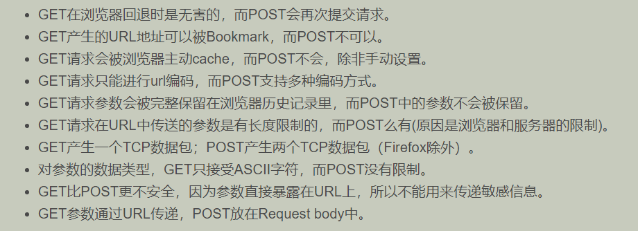
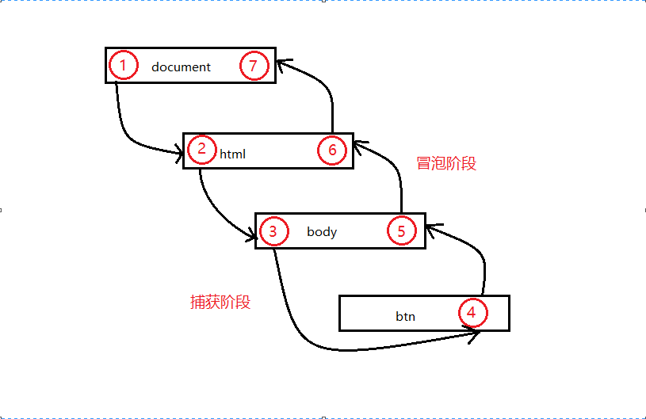

# 问题
## GET请求和POST请求的区别
1. 请求长度的限制
  + GET请求：浏览器或WEB服务器会对 url 的长度进行限制。
  + POST请求：由于没有 url 传值，理论上是不会受到限制的，但是实际上各个服务器会对 POST 提交的数据大小进行限制。
2. 安全性的区别
  + GET请求：进行登录操作时，会将用户名与密码暴露在 url 上，信息容易被获取。除此之外，GET请求提交的数据还可能会造成CSRF攻击。
  + POST请求：数据通过Request Body传递，不会出现在 url 上。
3. 缓存方面的区别
  + GET请求：类似于查找的过程，用户获取数据，可以不用每次都与数据库连接，所以可以使用缓存。
  + POST请求：一般是修改和删除的工作，所以必须与数据库交互，所以不能使用缓存。
4. 获取数据的区别
  + GET请求：从服务器上获取数据，服务器用Request.QueryString获取变量的值。
  + POST请求：向服务器传送数据，服务器用Request.Form获取提交的数据。  


[参考](https://www.cnblogs.com/princess-knight/p/9293332.html)
### get 请求传参长度的误区
HTTP 协议 未规定 GET 和 POST 的长度限制，  
GET 的最大长度显示是因为 浏览器和 WEB 服务器限制了 URL 的长度，  
不同的浏览器和 WEB 服务器，限制的最大长度不一样。  

## 一句话粗略概括闭包
闭包就是能够读取其他函数内部变量的函数，或者子函数在外调用，子函数所在的父函数的作用域不会被释放。

## 前端中的事件流
事件流：事件流描述的是从页面中接收事件的顺序,DOM2 级事件流包括下面几个阶段。  
  + 事件捕获阶段
  + 处于目标阶段
  + 事件冒泡阶段   

HTML 中与 javascript 交互是通过事件驱动来实现的，可以向文档或者文档中的元素添加事件侦听器来预订事件。

## 如何让事件先冒泡后捕获
**在 DOM 标准事件模型中，是<font color="red">先捕获后冒泡</font>**。  
但是如果要**实现先冒泡后捕获的效果**，对于同一个事件，监听捕获和冒泡，分别对应相应的处理函数，监听到捕获事件，先暂缓执行，直到冒泡事件被捕获后再执行捕获之间。

## 事件委托
事件委托指的是，不在事件的发生地（直接 dom）上设置监听函数，而是在其父元素上设置监听函数，  
通过事件冒泡，父元素可以监听到子元素上事件的触发，通过判断事件发生元素 DOM 的类型，来做出不同的响应。  

## 图片的懒加载和预加载
+ 预加载：提前加载图片，当用户需要查看时可直接从本地缓存中渲染。
+ 懒加载：延缓或不加载，懒加载的主要目的是作为服务器前端的优化，减少请求数或延迟请求数。

懒加载对服务器前端有一定的缓解压力作用，预加载则会增加服务器前端压力。

## mouseover 和 mouseenter 的区别
+ mouseover(鼠标覆盖)  
  mouseover 会被它的子元素影响到,在触发子元素的时候,mouseover 会冒泡触发它的父元素
+ mouseenter(鼠标进入)  
  mouseenter 不会冒泡,简单的说,它不会被它本身的子元素的状态影响到

当二者都没有子元素时,二者的行为是一致的,但是二者内部都包含子元素时,行为就不同了

## JS 的 new 操作符做了哪些事情
(1) 创建一个新对象；    
(2) 将构造函数的作用域赋给新对象（因此 this 就指向了这个新对象）；  
(3) 执行构造函数中的代码（为这个新对象添加属性）；   
(4) 返回新对象。   

## JS 的各种位置
+ **元素**
  - offsetLeft （距离定位父级的距离）
  - offsetTop （距离定位父级的距离）
  - offsetWidth （可视宽度）
  - offsetHeight （可视高度 包含了 border 和滚动条）
  - clientLeft （左边框宽度）
  - clientTop （上边框宽度）
  - clientWidth（width + padding）
  - clientHeight（height + padding 不包含 border 和滚动条）
  - scrollTop（纵向滚动距离 滚动后被隐藏的高度）
  - scrollLeft（横向滚动距离）
  - scrollWidth（内容宽度）
  - scrollHeight（内容高度 包含了因为滚动被隐藏的部分）
+ **getBoundingClientRect ( ) 返回值**
  - left（元素左侧相对于可视区左上角的距离）
  - right（元素右侧相对于可视区左上角的距离）
  - top（元素上边相对于可视区左上角的距离）
  - bottom（元素下边相对于可视区左上角的距离）
  - width（可视宽度）
  - height（可视高度）
+ **获取可视区宽高**
  - window.innerWidth
  - window.innerHeight
  - document.documentElement.clientWidth
  - document.documentElement.clientHeight
+ **获取文档宽高**
  - document.body.clientWidth
  - document.body.clientHeight
  - document.documentElement.scrollWidth
  - document.documentElement.scrollHeight
  - document.body.scrollWidth（如果内容宽度超过一屏，得到文档宽度；如果内容小于一屏，得到一屏的宽度）
  - document.body.scrollHeight （如果内容高度超过一屏，得到文档高度；如果内容小于一屏，得到一屏的高度）
+ **获取滚动条距离**
  - document.body.scrollTop
  - document.body.scrollLeft
  - window.scrollY
  - window.scrollX
  - document.documentElement.scrollTop
  - document.documentElement.scrollLeft
  - window.pageYOffset
  - window.pageXOffset

## Ajax 解决浏览器缓存问题
+ 浏览器缓存原因  
  ajax能提高页面载入的速度主要的原因是ajax能实现局部刷新，通过局部刷新机制减少了重复数据的载入，也就是说在载入数据的同时将数据缓存到内存中，一旦数据被加载其中，只要没有刷新页面，这些数据就会一直被缓存在内存中，当我们提交 的URL与历史的URL一致时，就不需要提交给服务器，也就是不需要从服务器上面去获取数据。那么，我们得到还是最开始缓存在浏览器中的数据。虽然降低了服务器的负载提高了用户的体验，但是我们不能获取最新的数据。为了保证我们读取的信息都是最新的，我们就需要禁止他的缓存功能。
+ 解决方法  
  （1）在ajax发送请求前加上 anyAjaxObj.setRequestHeader("If-Modified-Since","0")。    
         原理：If-Modified-Since:0 故意让缓存过期    
（2）在ajax发送请求前加上 anyAjaxObj.setRequestHeader("Cache-Control","no-cache")。     
         原理：直接禁用缓存机制  
（3）在URL后面加上一个随机数： "fresh=" + Math.random();。   
         原理：强行让每次的请求地址不同  
（4）在URL后面加上时间搓："nowtime=" + new Date().getTime();。  
         原理：强行让每次的请求地址不同  
（5）如果是使用jQuery，直接这样就可以了$.ajaxSetup({cache:false})。  
         原理：不设置ajax缓存  
[参考](https://blog.csdn.net/qq_39561207/article/details/90487580)

## JS 的防抖和节流
+ 防抖  
  对于短时间内连续触发的事件（上面的滚动事件），防抖的含义就是让某个时间期限（如上面的1000毫秒）内，事件处理函数只执行一次。  
+ 节流  
  如果短时间内大量触发同一事件，那么在函数执行一次之后，该函数在指定的时间期限内不再工作，直至过了这段时间才重新生效。  
[参考](https://segmentfault.com/a/1190000018428170)

## 垃圾回收机制
垃圾回收的方法：标记清除、计数引用。
+ 标记清除  
  当变量进入环境时，就标记这个变量为“进入环境”，当离开环境时，就标记为离开环境。  
  垃圾回收程序运行的时候，会标记内存中存储的所有变量（记住，标记方法有很多种）。然后，它
  会将所有在上下文中的变量，以及被在上下文中的变量引用的变量的标记去掉。在此之后再被加上标记
  的变量就是待删除的了，原因是任何在上下文中的变量都访问不到它们了。随后垃圾回收程序做一次内
  存清理，销毁带标记的所有值并收回它们的内存。
+ 引用计数   
  对每个值都记录它被引用的次数。声明变量并给它赋一个引用值时，这个值的引用数为 1。   
  如果同一个值又被赋给另一个变量，那么引用数加 1。类似地，如果保存对该值引用的变量被其他值给覆盖了，   
  那么引用数减 1。当一个值的引用数为 0 时，就说明没办法再访问到这个值了，因此可以安全地收回其内存了。   
  垃圾回收程序下次运行的时候就会释放引用数为 0 的值的内存。  

引用计数的严重问题：循环引用。
``` js
所谓循环引用，就是对象 A 有一个指针指向对象 B，而对象 B 也引用了对象 A。
function problem() {
 let objectA = new Object();
 let objectB = new Object();
 objectA.someOtherObject = objectB;
 objectB.anotherObject = objectA;
} 
在这个例子中，objectA 和 objectB 通过各自的属性相互引用，意味着它们的引用数都是 2。在
标记清理策略下，这不是问题，因为在函数结束后，这两个对象都不在作用域中。而在引用计数策略下，
objectA 和 objectB 在函数结束后还会存在，因为它们的引用数永远不会变成 0。如果函数被多次调
用，则会导致大量内存永远不会被释放。
```

## eval 是做什么的
它的功能是将对应的字符串解析成 JS 并执行，应该避免使用 JS，因为非常消耗性能（2次，一次解析成 JS，一次执行）

## 理解前端模块化
前端模块化就是复杂的文件编程一个一个独立的模块，比如 JS 文件等等，分成独立的
模块有利于重用（复用性）和维护（版本迭代），这样会引来模块之间相互依赖的问题，
所以有了 commonJS 规范，AMD，CMD 规范等等，以及用于 JS 打包（编译等处理）的
工具 webpack

### CommonJS、AMD
CommonJS：开始于**服务器端的模块化**，同步定义的模块化，每个模块都是一个单独的
作用域，模块输出，modules.exports，模块加载 require()引入模块。  

AMD：中文名异步模块定义的意思，它主要为**前端JS**的表现制定规范。
requireJS 实现了 AMD 规范，主要用于解决下述两个问题。
1.多个文件有依赖关系，被依赖的文件需要早于依赖它的文件加载到浏览器。
2.实现js文件的异步加载，避免网页失去响应。

## 对象深度克隆的简单实现
``` js
function deepClone(obj){
  var newObj= obj instanceof Array ? []:{};
  for(var item in obj){
    var temple= typeof obj[item] == 'object' ? deepClone(obj[item]):obj[item];
    newObj[item] = temple;
  }
  return newObj;
}
```

## 实现一个 once 函数，传入函数参数只执行一次
``` js
 //只执行一次函数
function once(fn){
  var ifFalse = true
  return function(){
    if(ifFalse){
      ifFalse = false
      fn()
    }
  }
}
//调用
function getName(){
  console.log('我不是小明')
}
getName = once(getName)
getName() //我不是小明
getName() //不执行
```

## 将原生的 ajax 封装成 promise
``` js
var myNewAjax=function(url){
  return new Promise(function(resolve,reject){
    var xhr = new XMLHttpRequest();
    xhr.open('get',url);
    xhr.send(data);
    xhr.onreadystatechange=function(){
      if(xhr.status==200&&readyState==4){
      var json=JSON.parse(xhr.responseText);
      resolve(json)
      }else if(xhr.readyState==4&&xhr.status!=200){
        reject('error');
      }
    }
  })
}
```

## JS 监听对象属性的改变
``` js
// ES5
Object.defineProperty(user, 'name', {
  set : funtion(value){
    name = value;
    console.log('set: name:' + value)
  }
  get : function() {
    return name
  }
})

//ES6
funtion handle(){
  // 改写set方法，监听设置
  set: funtion(){},
  get: funtion(){}
}
let p = new Proxy({},handle) // 第一个参数为监听的对象，第二个参数为改写的方法
```

## 实现一个私有变量，用 getName 方法可以访问，不能直接访问
``` js
(1)通过 defineProperty 来实现
obj={
  name:yuxiaoliang, getName:function(){
    return this.name
  }
}
object.defineProperty(obj,"name",{
  Enumerable: false
}}

(2)通过函数的创建形式
function product(){
  var name='yuxiaoliang';
  this.getName=function(){
    return name;
  }
}
var obj = new product();
```

## == 和 ===、以及 Object.is 的区别
1、===：称为等同符，当两边值的类型相同时，直接比较值，若类型不相同，直接返回false；  
2、==：称为等值符，当等号两边的类型相同时，直接比较值是否相等，若不相同，则先转化为类型相同的值，再进行比较；

类型转换规则：  
(1)如果等号两边是boolean、string、number三者中任意两者进行比较时，优先转换为数字进行比较。  
(2)如果等号两边出现了null或undefined,null和undefined除了和自己相等，就彼此相等  
注意：NaN==NaN  //返回false，NaN和所有值包括自己都不相等。  

Object.is()是 ES6 新增的用来比较两个值是否严格相等的方法，与 === 的行为基本一致。  
其行为与===基本一致，不过有两处不同:  
1. +0 不等于 -0。
2. NaN 等于自身。

## setTimeout、setInterval 和 requestAnimationFrame
+ setTimeout(fn,t),超时调用，超过时间t，就执行fn。  
+ setInterval(fn,t),间歇调用，调用周期t，执行fn。  

+ requestAnimationFrame  
  （1）requestAnimationFrame 会把每一帧中的所有 DOM 操作集中起来，在一次重绘或回  
   流中就完成，并且重绘或回流的时间间隔紧紧跟随浏览器的刷新频率。  
  （2）在隐藏或不可见的元素中，requestAnimationFrame 将不会进行重绘或回流，这当然  
   就意味着更少的 CPU、GPU 和内存使用量  
  （3）requestAnimationFrame 是由浏览器专门为动画提供的 API，在运行时浏览器会自动  
   优化方法的调用，并且如果页面不是激活状态下的话，动画会自动暂停，有效节省了  
   CPU 开销。  
   [使用例子](https://www.cnblogs.com/xiaohuochai/p/5777186.html)   

## 如何实现 sleep 的效果
``` js
通过 promise 来实现
function sleep(ms){
  var temple=new Promise(
    (resolve)=>{
      console.log(111);setTimeout(resolve,ms)
    });
    return temple
  }
  sleep(500).then(function(){
    //console.log(222)
})
//先输出了 111，延迟 500ms 后输出 222

通过 async 封装
function sleep(ms){
  return new Promise((resolve)=>setTimeout(resolve,ms));
}
async function test(){
  var temple=await sleep(1000);
  console.log(1111)
  return temple
}
test();
```

## 简单的实现一个 promise
[链接](https://zhuanlan.zhihu.com/p/84757243)

## `Function._proto_`(getPrototypeOf)是什么
获取一个对象的原型  
在 chrome 中可以通过_proto_的形式  
在 ES6 中可以通过 Object.getPrototypeOf 的形式。  
`Function.__proto__==Object.prototype //false`  
`Function.__proto__==Function.prototype//true`  


## 数组去重
[链接](https://segmentfault.com/a/1190000019547180)

## 事件代理在捕获阶段的实际应用
可以在父元素层面阻止事件向子元素传播，也可代替子元素执行某些操作。

## 去除字符串首尾空格
使用正则(^\s*)|(\s*$)即可

## 性能优化
+ 减少 HTTP 请求
+ 使用内容发布网络（CDN）
+ 添加本地缓存
+ 压缩资源文件
+ 将 CSS 样式表放在顶部，把 javascript 放在底部（浏览器的运行机制决定）
+ 避免使用 CSS 表达式
+ 减少 DNS 查询
+ 使用外部 javascript 和 CSS
+ 避免重定向
+ 图片 lazyLoad

## 为什么要用闭包
匿名自执行函数：我们知道所有的变量，如果不加上 var 关键字，则默认的会添加到全
局对象的属性上去，这样的临时变量加入全局对象有很多坏处，比如：别的函数可能误
用这些变量；造成全局对象过于庞大，影响访问速度(因为变量的取值是需要从原型链
上遍历的)。除了每次使用变量都是用 var 关键字外，我们在实际情况下经常遇到这样一
种情况，即有的函数只需要执行一次，其内部变量无需维护，可以用闭包。

结果缓存：我们开发中会碰到很多情况，设想我们有一个处理过程很耗时的函数对象，
每次调用都会花费很长时间，那么我们就需要将计算出来的值存储起来，当调用这个函
数的时候，首先在缓存中查找，如果找不到，则进行计算，然后更新缓存并返回值，如
果找到了，直接返回查找到的值即可。闭包正是可以做到这一点，因为它不会释放外部
的引用，从而函数内部的值可以得以保留。

## JS 的语言特性
+ 运行在客户端浏览器上；
+ 不用预编译，直接解析执行代码；
+ 是弱类型语言，较为灵活；
+ 与操作系统无关，跨平台的语言；
+ 脚本语言、解释性语言

## 如何判断一个数组
+ Object.prototype.call.toString()
+ instanceof

## JS 实现跨域
+ JSONP：通过动态创建 script，再请求一个带参网址实现跨域通信。  
+ document.domain + iframe 跨域：两个页面都通过 js 强制设置 document.domain 为基础主域，就实现了同域。  
+ location.hash + iframe 跨域：a 欲与 b 跨域相互通信，通过中间页 c 来实现。 三个页面，  不同域之间利用 iframe 的 location.hash 传值，相同域之间直接 js 访问来通信。
+ window.name + iframe跨域：通过iframe的src属性由外域转向本地域，跨域数据即由iframe的 window.name 从外域传递到本地域。
+ postMessage 跨域：可以跨域操作的 window 属性之一。
+ CORS：服务端设置 Access-Control-Allow-Origin 即可，前端无须设置，若要带 cookie 请求，前后端都需要设置。
+ 代理跨域：启一个代理服务器，实现数据的转发
[链接](https://segmentfault.com/a/1190000011145364)
### 跨域原理
跨域，是指浏览器不能执行其他网站的脚本。它是由浏览器的同源策略造成的，是浏览
器对 JavaScript 实施的安全限制，那么只要协议、域名、端口有任何一个不同，都被当
作是不同的域。跨域原理，即是通过各种方式，避开浏览器的安全限制。

## 重排和重绘
重绘（repaint 或 redraw）：当盒子的位置、大小以及其他属性，例如颜色、字体大小等都确定下来之后，浏览器便把这些原色都按照各自的特性绘制一遍，将内容呈现在页面上。  
重绘是指一个元素外观的改变所触发的浏览器行为，浏览器会根据元素的新属性重新绘制，使元素呈现新的外观。  
触发重绘的条件：改变元素外观属性。如：color，background-color 等。  
注意：table 及其内部元素可能需要多次计算才能确定好其在渲染树中节点的属性值，比同等元素要多花两倍时间，这就是我们尽量避免使用 table 布局页面的原因之一。  

重排（重构/回流/reflow）：当渲染树中的一部分(或全部)因为元素的规模尺寸，布局，隐藏等改变而需要重新构建, 这就称为回流(reflow)。   
每个页面至少需要一次回流，就是在页面第一次加载的时候。  

重绘和重排的关系：在回流的时候，浏览器会使渲染树中受到影响的部分失效，并重新构造这部分渲染树，完成回流后，浏览器会重新绘制受影响的部分到屏幕中，该过程称为重绘。所以，重排必定会引发重绘，但重绘不一定会引发重排。

## 暂时性死区
在代码块内，使用 let、const 命令声明变量之前，该变量都是不可用的。这在语法上，称为“暂时性死区

## Virtual DOM
用 JavaScript 对象结构表示 DOM 树的结构；然后用这个树构建一个真正的 DOM 树，
插到文档当中 当状态变更的时候，重新构造一棵新的对象树。然后用新的树和旧的树
进行比较，记录两棵树差异 把所记录的差异应用到所构建的真正的 DOM 树上，视图就
更新了。Virtual DOM 本质上就是在 JS 和 DOM 之间做了一个缓存。

## webpack 用来干什么的
webpack 是一个现代 JavaScript 应用程序的静态模块打包器(module bundler)。当
webpack 处理应用程序时，它会递归地构建一个依赖关系图(dependency graph)，其中包
含应用程序需要的每个模块，然后将所有这些模块打包成一个或多个 bundle。

## JS 中继承实现的几种方式
1. 原型链继承，将父类的实例作为子类的原型，他的特点是实例是子类的实例也是父类的实例，父类新增的原型方法/属性，子类都能够访问，并且原型链继承简单易于实现，缺点是来自原型对象的所有属性被所有实例共享，无法实现多继承，无法向父类构造函数传参。
2. 构造继承，使用父类的构造函数来增强子类实例，即复制父类的实例属性给子类，构造继承可以向父类传递参数，可以实现多继承，通过 call 多个父类对象。但是构造继承只能继承父类的实例属性和方法，不能继承原型属性和方法，无法实现函数服用，每个子类都有父类实例函数的副本，影响性能
3. 实例继承，为父类实例添加新特性，作为子类实例返回，实例继承的特点是不限制调用方法，不管是 new 子类（）还是子类（）返回的对象具有相同的效果，缺点是实例是父类的实例，不是子类的实例，不支持多继承
4. 拷贝继承：特点：支持多继承，缺点：效率较低，内存占用高（因为要拷贝父类的属性）无法获取父类不可枚举的方法（不可枚举方法，不能使用 for in 访问到）
5. 组合继承：通过调用父类构造，继承父类的属性并保留传参的优点，然后通过将父类实例作为子类原型，实现函数复用
6. 寄生组合继承：通过寄生方式，砍掉父类的实例属性，这样，在调用两次父类的构造的时候，就不会初始化两次实例方法/属性，避免组合继承的缺点

## 介绍一下 promise，及其底层如何实现
Promise 是一个对象，保存着未来将要结束的事件，她有两个特征:   
1、对象的状态不受外部影响，Promise 对象代表一个异步操作，有三种状态，pending进行中，fulfilled 已成功，rejected 已失败，只有异步操作的结果，才可以决定当前是哪一种状态，任何其他操作都无法改变这个状态，这也就是 promise 名字的由来  
2、一旦状态改变，就不会再变，promise 对象状态改变只有两种可能，从 pending 改到fulfilled 或者从 pending 改到 rejected，只要这两种情况发生，状态就凝固了，不会再改变，这个时候就称为定型 resolved, Promise 的基本用法，  

``` js
let promise1 = new Promise(function(resolve,reject){
  setTimeout(function(){
    resolve('ok')
    },1000)
  })
  promise1.then(function success(val){
    console.log(val)
})
```

``` js
最简单代码实现 promise
class PromiseM {
  constructor (process) {
    this.status = 'pending' 
    this.msg = '' 
    process(this.resolve.bind(this), this.reject.bind(this))
    return this
  }
  resolve (val) {
    this.status = 'fulfilled' 
    this.msg = val
  }
  reject (err) {
    this.status = 'rejected' 
    this.msg = err
  }
  then (fufilled, reject) {
    if(this.status === 'fulfilled') {
      fufilled(this.msg)
    }
    if(this.status === 'rejected') {
      reject(this.msg)
    }
  }
}
//测试代码
var mm=new PromiseM(function(resolve,reject){
  resolve('123');
});
mm.then(function(success){
  console.log(success);
},function(){
  console.log('fail!');
}); 
```