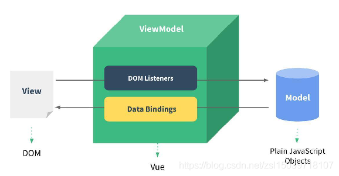

# 基础语法
[链接](https://blog.csdn.net/weixin_43200099/article/details/115473638)
## hello Vue
``` vue
<body>
    <!-- 界面与数据分离 -->
    <div id="app">{{message}}</div>
    <script src="../js/vue.js"></script>
    <script>
        //声明式编程（曾经是命令式编程）
        const app = new Vue({
            el: '#app',//挂载要管理的元素
            data: {
                message: 'hello Vue！'//更改message后自动改，不需要操纵界面，响应式
            }
        })
    </script>
</body>
```

## 指令
### 文本渲染方法 Mustache语法 v-text v-html
+ Mustache  
  Mustache 标签将会被替代为对应数据对象上 message property 的值。无论何时，绑定的数据对象上 message property 发生了改变，插值处的内容都会更新。  
+ v-text  
  v-text会将元素当成纯文本输出  
+ v-html  
  v-html会将元素当成HTML标签解析后输出  

``` vue
<div>{{ message }}</div>
<div v-text='message'></div>
<div v-html='message'></div>
```
### v-once
不需要任何表达式，它的作用就是定义它的元素或组件只会渲染一次，包括元素或者组件的所有字节点。首次渲染后，不再随着数据的改变而重新渲染。也就是说使用v-once，那么该块都将被视为静态内容。
### v-if v-else v-else-if
+ v-if  
  用于条件性地渲染一块内容。 
  若条件为 false，对应的元素及其子元素都不会被渲染，对应标签不存在于DOM中。  
+ v-else   
  与 v-if 配合使用，若 v-if 条件为 false，则渲染 v-else 块。  
``` vue
<div v-if="false"> if </div>
<div v-else> else </div>

```
+ v-else-if  
  v-else-if，顾名思义，充当 v-if 的“else-if 块”，可以连续使用。  
  类似于 v-else，v-else-if 也必须紧跟在带 v-if 或者 v-else-if 的元素之后。  
``` vue
<div v-if="type === 'A'">
  A
</div>
<div v-else-if="type === 'B'">
  B
</div>
<div v-else-if="type === 'C'">
  C
</div>
<div v-else>
  Not A/B/C
</div>
```
### v-show
与 v-if 写法一样，决定元素是否显示。  
v-show 隐藏 是 display:'none'; 元素依然存在于dom中，只是不可见。  
v-if 隐藏是 visibility:hidden; 元素不会存在于dom中  
**如果切换频率很高就用v-show，否则v-if(用的更多）**  
### v-on
1. 如果不需要传参，那么在事件定义时，写方法有没有小括号都无所谓。
2. 当需要传参，就正常写小括号传参
3. 如果省略了小括号，但是方法本身是需要一个参数的，那么默认会把浏览器产生的event事件对象作为参数传给方法  
``` vue
  <!-- <button v-on:click="btn1Click">按钮1</button>  完整写法  -->
   <button @click="btn1Click">按钮1</button>    <!-- v-on缩写 语法糖：-->

  </div>
  <script src="../js/vue.js"></script>
  <script>
    const app = new Vue({
      el: '#app',
      methods: {
        btn1Click(abc) {
          console.log(abc);
        }
      }
    })
  </script>
```
4. 当我们需要event对象又需要别的参数：一般来说我们省略就传递了event，但这里我们用$event来传递（不能直接写event，不然它就是个没有定义的变量）如果123用变量代替了则需要在data里定义这个变量；
``` vue
<div id="app">
    <!-- <button @click="btn1Click()">按钮1</button> -->
    <button @click="btn1Click(123,$event)">按钮1</button>

  </div>
  <script src="../js/vue.js"></script>
  <script>
    const app = new Vue({
      el: '#app',
      methods: {
        btn1Click(abc, event) {
          console.log(abc);
          console.log(event);
        }
      }
    })
  </script>
```
#### v-on 事件修饰符
+ .stop 阻止事件冒泡
+ .prevent 阻止默认事件发生
+ .once 事件只执行一次
+ .self 只会触发自己范围内的事件，不包含子元素
使用例子：`<a @click.stop="doThis"></a>`
### v-bind
动态绑定属性  
属性不能用Mustache语法  
缩写 语法糖 ：  
``` vue
<!-- 绑定一个 attribute -->


<!-- 动态 attribute 名 (2.6.0+) -->
<button v-bind:[key]="value"></button>

<!-- 缩写 -->


<!-- 动态 attribute 名缩写 (2.6.0+) -->
<button :[key]="value"></button>

<!-- 内联字符串拼接 -->


<!-- class 绑定 -->
<div :class="{ red: isRed }"></div>
<div :class="[classA, classB]"></div>
<div :class="[classA, { classB: isB, classC: isC }]">

<!-- style 绑定 -->
<div :style="{ fontSize: size + 'px' }"></div>
<div :style="[styleObjectA, styleObjectB]"></div>

<!-- 绑定一个全是 attribute 的对象 -->
<div v-bind="{ id: someProp, 'other-attr': otherProp }"></div>

<!-- 通过 prop 修饰符绑定 DOM attribute -->
<div v-bind:text-content.prop="text"></div>

<!-- prop 绑定。“prop”必须在 my-component 中声明。-->
<my-component :prop="someThing"></my-component>

<!-- 通过 $props 将父组件的 props 一起传给子组件 -->
<child-component v-bind="$props"></child-component>
```
### v-model
v-model是双向绑定，也就是说我们更改input里的内容，写在下面的data里的值也是会改变的，反之同理。  
它的原理其实是 v-bind 和 v-on：input 的结合。  
[表单用法](https://cn.vuejs.org/v2/guide/forms.html)  
**修饰符**  
v-model.lazy 只有敲完回车或者鼠标失去焦点时才绑定内容。  
v-model.number 自动将用户的输入值转为数值类型  
v-model.trim 自动过滤用户输入的首尾空白字符  
### v-for
基于源数据多次渲染元素或模板块。此指令之值，必须使用特定语法 alias in expression，为当前遍历的元素提供别名  
``` html
<div v-for="(item, index) in items"></div>

<div v-for="item in items" :key="item.id">
  {{ item.text }}
</div>
```
+ v-for 循环的时候，key 属性只能使用 number 或 String。  
+ key 在使用的时候，必须使用 v-bind 属性绑定的形式，指定 key 的值。  
+ 在组件中使用 v-for 循环的时候，或者在一些特殊情况中，如果 v-for 有问题，必须在使用 v-for 的同时，指定唯一的 字符串/数字 类型 :key 值。  

## 计算属性
它的本质是属性，**不需要加小括号**，写在computed里面。  
计算属性就是当其依赖属性的值发生变化时，这个属性的值会自动更新，与之相关的DOM部分也会同步自动更新。  
它有一个好处就是，它把新的**数据缓存**下来了，当其他的依赖数据没有发生改变，它调用的是缓存的数据，这就极大的提高了我们程序的性能。  
``` vue
<div id="example">
  <p>Original message: "{{ message }}"</p>
  <p>Computed reversed message: "{{ reversedMessage }}"</p>
</div>
<script>
var vm = new Vue({
  el: '#example',
  data: {
    message: 'Hello'
  },
  computed: {
    // 计算属性的 getter
    reversedMessage: function () {
      // `this` 指向 vm 实例
      return this.message.split('').reverse().join('')
    }
  }
})
</script>
```
## 侦听器
侦听属性Watch，当你有一些数据需要随着其它数据变动而变动时，就可以使用Watch来监听他们之间的变化。  
``` vue
<body>
  <div id="app">
    <input type="text" v-model="message">
    <h2>状态：{{ state }}</h2>
  </div>
</body>
<script>
let vm = new Vue({
  el: '#app',
  data: {
    message: 'Hello',
    state: '【未修改】'
  },
  watch: {//监听属性
    // 绑定监听数据
    message: function (e){
      // 当数据修改时做出响应(处理函数)
      this.state = '已修改'
    }
  }
})
</script>
```
需要在数据变化时执行异步或开销较大的操作时 watch 这个方式是最有用的。   

## Vue中的 MVVM

+ Model 就是数据模型（亦指数据层）可以是我们固定死的数据，也可以是来自服务器请求来的数据。
+ View 就是页面 DOM（亦指视图层）主要就是向用户展示信息的。
+ ViewModel 在 vue 中就是指 vue 实例（亦指数据模型层）充当 View 与 Model 之间通信的桥梁。

首先ViewModel通过 Data Bindings 让 Model 中的数据实时的在 View(DOM) 中显示。  
其次ViewModel通过 DOM Listener 来监听 DOM 事件(点击，滚动等)，并且通过 methods 中的操作，来改变 Model 中的数据。  

## 生命周期


## Vue 组件
### 组件名
+ 使用 kebab-case  
  当使用 kebab-case (短横线分隔命名) 定义一个组件时，你也必须在引用这个自定义元素时使用 kebab-case，例如 `<my-component-name>`
+ 使用 PascalCase  
  当使用 PascalCase (驼峰式命名) 定义一个组件时，你在引用这个自定义元素时两种命名法都可以使用。也就是说 `<my-component-name>` 和 `<MyComponentName>` 都是可接受的。注意，尽管如此，直接在 DOM (即非字符串的模板) 中使用时只有 kebab-case 是有效的

### 全局注册
利用Vue.component()方法，先传入一个自定义组件的名字，然后传入这个组件的配置。
``` vue
 Vue.component('mycomponent',{
    template: `<div>这是一个自定义组件</div>`,
    data () {
      return {
        message: 'hello world'
      }
    }
  })
```

### 局部注册
可以在某个Vue实例中注册只有自己能使用的组件。
``` vue
 <div id="app">
    <my-component></my-component>
</div>

var app = new Vue({
    el: '#app',
    data: {
    },
    components: {
      'my-component': {
        template: `<div>这是一个局部的自定义组件，只能在当前Vue实例中使用</div>`,
      }
    }
  })
```

### 父子组件传值
父组件通过 prop 向下传递数据，子组件通过`$emit`向父组件发送信息，
父组件通过 v-on 监听子组件传送的事件。
``` vue
<!-- 父组件 -->
<template>
    <div>
        <my-child :sex="sex" @childEvent="parentMethod"></my-child>
    </div>
</template>

<script>
    import MyChild from '@components/common/MyChild'

    export default {
        components: {
            MyChild
        },
        data() {
            return {
                sex: '女',
                parentMessage: '我是来自父组件的消息'
            }
        },
        methods: {
            parentMethod({ name, age }) {
                console.log(this.parentMessage, name, age)
            }
        }
    }
</script>

<!-- 子组件 -->
<template>
    <div>
        <h3>子组件</h3>
    </div>
</template>

<script>
    export default {
        props: {
          sex: {
            type: String,
            default: '男'
          }
        },
        mounted() {
            this.$emit('childEvent', { name: 'zhangsan', age:  10 })
        }
    }
</script>
```
### refs 获取
一般都是我们需要拿哪个子组件就给他加一个ref属性，后面跟键值如’aaa’，我们需要调用子组件的方法（如show())时就用this.$refs.aaa.show() $refs默认是一个空对象
``` vue
<body>
  <div id="app">
    <cpn></cpn>
    <cpn></cpn>
    <cpn ref="aaa"></cpn>
    <button @click="btnClick">按钮</button>
  </div>

  <template id="cpn">
    <div>我是子组件</div>
  </template>
  <script src="../js/vue.js"></script>
  <script>
    const app = new Vue({
      el: '#app',
      data: {
        message: 'hi',
      },
      methods: {
        btnClick() {
          /*          console.log(this.$children);
                    //此处记住this，是这个实例化对象的children */
          console.log(this.$refs.aaa);
          this.$refs.aaa.showMessage()
        }
      },
      components: {
        cpn: {
          template: '#cpn',
          methods: {
            showMessage() {
              console.log('message');
            }
          }
        }
      }
    })
  </script>
</body>

```

## 插槽
### 默认插槽
``` vue
<!-- <submit-button> 组件定义了如下插槽-->
<button type="submit">
  <slot></slot>
</button>

<submit-button> 提交按钮 </submit-button>

组件中填充的内容将替换掉<slot></slot>
```
### 具名插槽
`<slot>` 元素有一个特殊的 attribute：name。这个 attribute 可以用来定义额外的插槽
``` vue
<myslot>子组件↓
<template>
  <div class="container">
    <header>
      <slot name="header"></slot>
    </header>
    <main>
      <slot></slot>
    </main>
    <footer>
      <slot name="footer"></slot>
    </footer>
  </div>
</template>

<template>
  <myslot>
    <div>大家好我是父组件</div>
    <template v-slot:header>
      <h1>Here might be a page title</h1>
    </template>

    <p>A paragraph for the main content.</p>
    <p>And another one.</p>

    <template v-slot:footer>
      <p>Here's footer info</p>
    </template>
  </myslot>
</template>

<script>
  import myslot from './myslot';
  export default {
    components: {
      myslot
    }
  }
</script>
```
父组件中会向子组件中具名传递对应的模板内容，而没有指定名字的模板内容会传递给子组件中不带 name 的 `<slot>` ，如果父组件中  
同样是传递给子组件中不带 name 的 `<slot>` 注意: v-slot 只能添加在 `<template>` 上 具名插槽在书写的时候可以使用缩写,v-slot用#来代替

### 作用域插槽
在作用域插槽内，父组件可以拿到子组件的数据。子组件可以在slot标签上绑定属性值
``` vue
<template>
 <div class="child">
    <h3>这里是子组件</h3>
    <slot name="demo" :text="account" :record="user"></slot>
  </div>
</template>

<script>
export default {
    name:"child",
    data(){
      return {
        user: ['张三','李四',"王五"],
        account:"ray"
      }
    }
}
</script>


<template>
  <div class="father">
    <child>
      <template  slot="demo" slot-scope="{text,record}">
       {{text}}
       <div v-for="item in record" :key="item">{{item}}</div>
      </template>
    </child>
     <child>
      <template  v-slot:demo="{text,record}">
       {{text}}
       <div v-for="item in record" :key="item">{{item}}</div>
      </template>
    </child>
  </div>
</template>

<script>
import Vue from 'vue'

import ChildSlot from '@/components/ChildSlot.vue'

Vue.component(ChildSlot.name, ChildSlot);

export default {
  name: 'HelloWorld',
 
}
</script>
```


